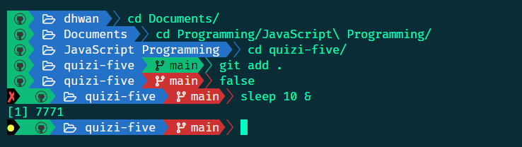

# Git bash for Windows Powerline Theme

Light & simple powerline theme for Git bash for windows




## Pre-Requisites

* In order for this theme to render correctly, you will need a [Nerd font](https://github.com/ryanoasis/nerd-fonts).


## Installation:

I recommend the following:

```bash
cd $HOME
mkdir -p .bash/themes/git_bash_powerline_theme
git clone https://github.com/dhwanish-3/git-bash-powerline-theme.git .bash/themes/git_bash_powerline_theme
```

Create .bashrc file in $HOME directory if you already don't have one:
   
```bash
cd $HOME
touch .bashrc
```

Then add the following lines to the end of your .bashrc file:

```bash
# Theme
THEME=$HOME/.bash/themes/git_bash_powerline_theme/theme.bash
if [ -f $THEME ]; then
   . $THEME
fi
unset THEME
```
